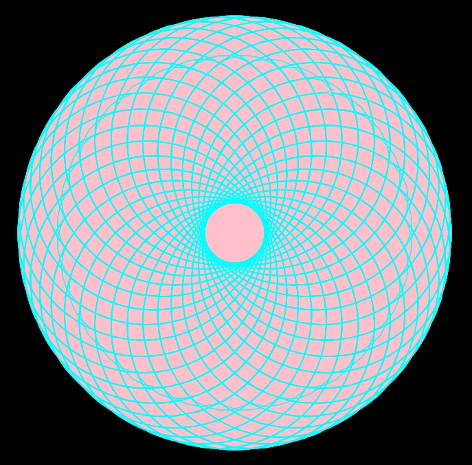

# Cyan & Pink Spiral with Python Turtle  

This project uses the Python **turtle** graphics library to draw a mesmerizing cyan and pink spiral pattern on a black background.  
By combining loops, fill colors, and overlapping circles, the program generates an eye-catching geometric artwork.  

## Features
- Draws a spiral pattern using Python turtle  
- Combines cyan outline with pink fill  
- High-speed drawing for quick results  
- Beginner-friendly and visually appealing  

## Preview
Here is the result of running the program:  

  

*Note: Replace `spiral_result.png` with a screenshot of your own output for accurate preview.*  

## How to Run
1. Install Python (3.x)  
2. Save the script as `turtle_spiral.py`  
3. Run the script in your IDE or terminal:  
   ```bash
   python turtle_spiral.py
   
